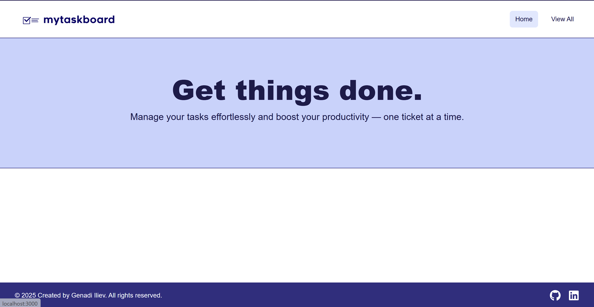
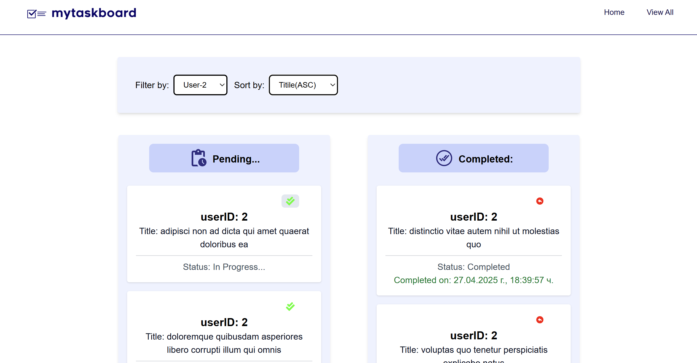

# To-Do Application (MyTaskBoard)
## Summary:
 Hello, this is my Demo version of To-Do application based on React. It's called MyTaskBoard. It consists of 2 pages - Home & ViewAll pages.
Home page displays the main page of the application which could undergo future changes and addition of more functionalities, while the ViewAll page
holds [data fetched from a public API](http://jsonplaceholder.typicode.com/todos). Through an HTTP request to this API the list of todos is retrieved
when the app is loaded.


*Note:The green and red buttons in these tickets are respectively 'Complete' and 'Undo'. They are completely functional!*
## Used technologies:
 During the project development I used technologies like:
- **React** -v19.0.0
- **React Router DOM** -v7.5.1
- **Tailwindcss** -v3.4.17
- **PostCSS** -v8.5.3
- **Autoprefixer** -v10.4.21
- **React Icons** -v5.5.0
- **Vite** -v6.3.1
- **ESLint** -v9.22.0

## Prerequisites:
- **Node.js** -v20.6.1
- **npm** -v9.8.1
- **Visual Studio Code** -v1.99.3 or higher

## Install dependencies and run app locally:
 After cloning the repository:
   1. Open your terminal inside the project folder
   2. Install all dependencies:
    ```npm install```
   3. Start the server:
    ```npm run dev```
   4. Click on:
   ```http://localhost:3000```
